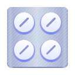

### Dosage
Keep track of your treatments

 

</a>  

### Features

- **Notifications** — Get reminders at the right time
- **History** — See which medications you took, skipped or missed
- **Dosage management** — Multiple doses with different times
- **Frequency modes** — Every day, selected days, cycle or just when necessary
- **Color and icon** — Give a shape for your treatment
- **Inventory tracking** — Monitor your stock and get reminded when it's low
- **Duration** — Define the start and end dates

  

    
Other screenshots
 
      

      

      

  

### Donate

If you want to help with a donation (thank you!), you can use:

- [PayPal](https://www.paypal.com/donate?hosted_button_id=DVL7H35GA66X6)
- [Ko-fi](https://ko-fi.com/diegopvlk)
- Pix: diego.pvlk@gmail.com

### Translations

You can help translate using [Weblate](https://hosted.weblate.org/projects/dosage/dosage/)

### Build from source

Clone the repo in GNOME Builder and press run
